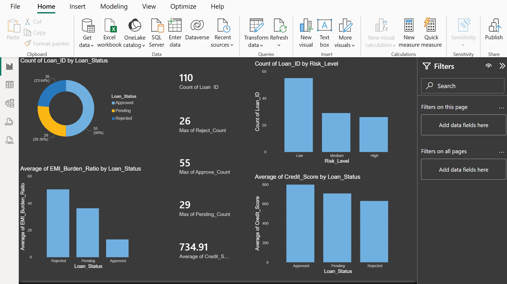
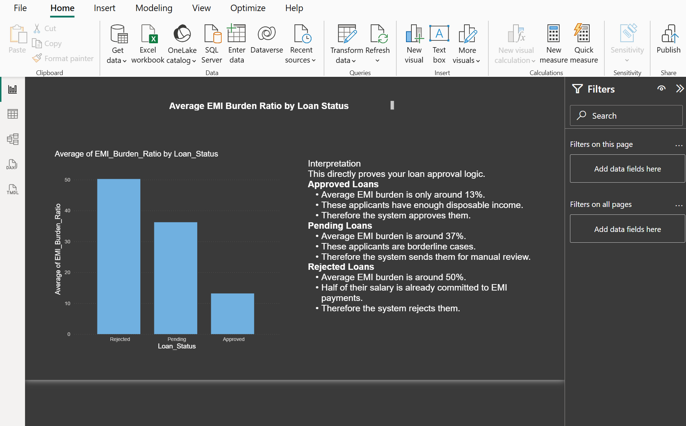
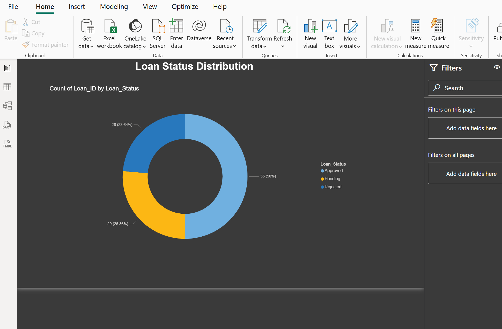
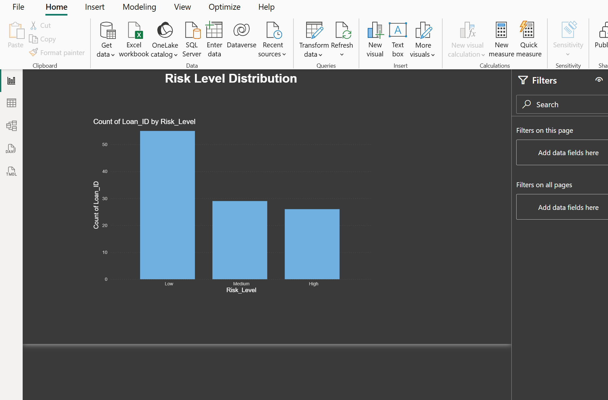

# 📊 Power BI Financial Dashboard

## Project Overview
This project presents an interactive Power BI dashboard developed for financial data analysis, KPI monitoring, risk assessment, and loan portfolio performance tracking. The dashboard helps visualize key financial metrics and supports data-driven decision-making.

---

## Objectives
- Analyze financial and loan-related data.
- Monitor key performance indicators (KPIs).
- Evaluate customer creditworthiness and risk levels.
- Track loan status and approval trends.
- Create interactive visualizations for business insights.

---

## Tools & Technologies
- Microsoft Power BI
- Microsoft Excel
- Data Visualization
- Financial Analytics
- KPI Reporting

---

## Dashboard Features

### 1. Overall Dashboard
Provides a complete overview of financial and loan performance metrics.



---

### 2. Key Performance Indicators (KPIs)
Displays important financial metrics and business performance indicators.


---

### 3. Average Credit Score Analysis
Analyzes customer credit scores to evaluate financial health and lending eligibility.


---

### 4. EMI Ratio Analysis
Shows EMI burden across customers and helps assess repayment capacity.



---

### 5. Loan Status Analysis
Visualizes approved, pending, and rejected loan applications.



---

### 6. Risk Level Assessment
Categorizes customers based on financial risk profiles.



---

## Key Insights
- Identified customer segments with higher credit scores.
- Evaluated loan approval and rejection patterns.
- Assessed customer repayment capacity using EMI ratios.
- Monitored financial risk levels across the portfolio.
- Improved decision-making through interactive reporting.

---

## Business Benefits
- Faster financial analysis.
- Improved risk assessment.
- Better loan portfolio management.
- Enhanced reporting and visualization.
- Data-driven decision-making support.

---

## Repository Structure

```
Power-BI-Dashboard/
│
├── DASHBORAD.FULL.png
├── KPIs.png
├── AVERAGECREDITSCORE.png
├── EMIRATIO.png
├── LOANSTATUS.png
├── RISKLEVEL.png
└── README.md
```

---

## Author

**Himani Sood**  
MBA Finance | Data Analytics Enthusiast  
GitHub: https://github.com/himanisood1357-rgb
